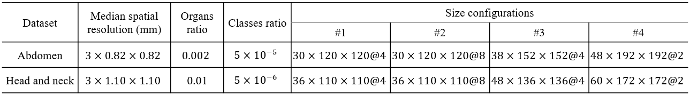
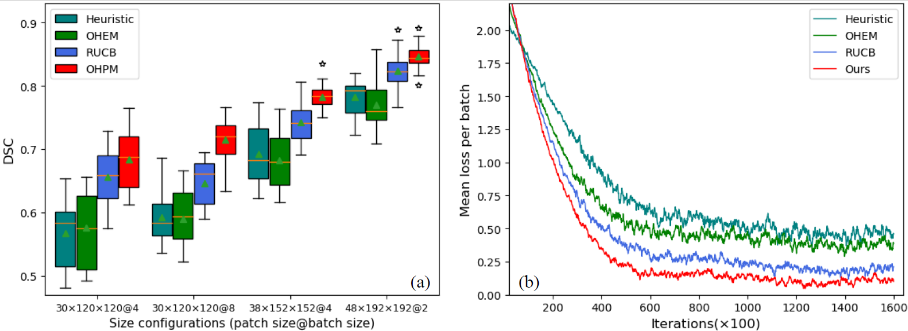
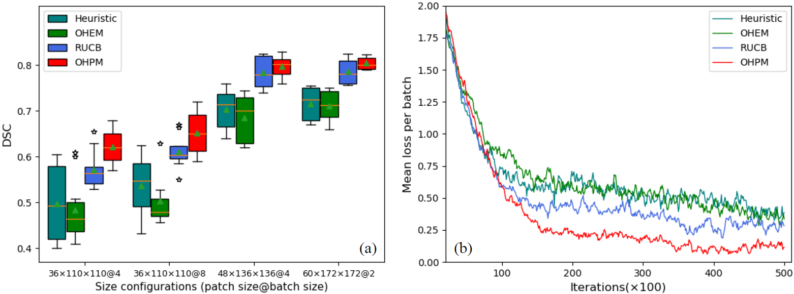
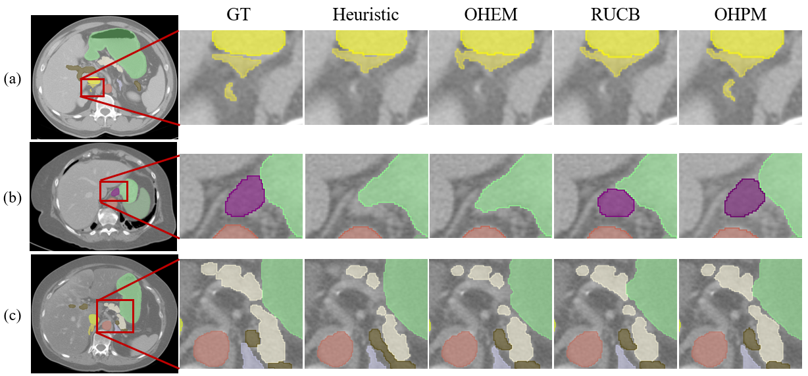
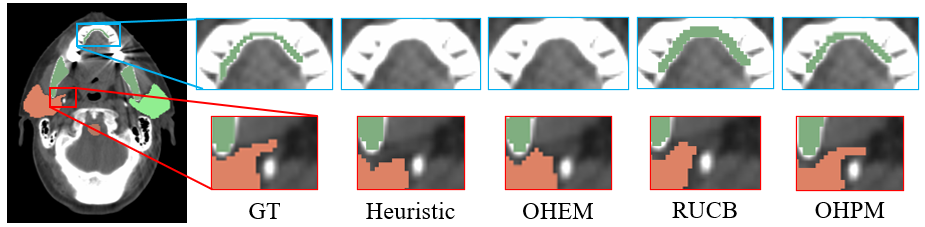

Code and Supplementary for paper "Online Hard Patch Mining Using Shape Models and Bandit Algorithm for Multi-Organ Segmentation"
## Dataset
### Sources:
**1. Abdominal dataset:**
- 47 images come from the [MICCAI Multi-Atlas Labeling Beyond the Cranial Vault challenge (BCV)](https://www.synapse.org/Synapse:syn3193805/wiki/89480).
- 43 images come from the [Cancer Image Archive Pancreas-CT dataset (TCIA)](https://wiki.cancerimagingarchive.net/display/Public/Pancreas-CT).
- 20 images come from the [Visceral Anatomy3](http://www.visceral.eu/benchmarks/anatomy3-open/).
- 25 images come from local hospital. 

**2. [Head and neck dataset (HaN)](https://edoc.unibas.ch/59211/1/20180122140606_5a65e1be0d4fc.pdf)**

### Attributes:
- 12 organs are delineated in the abdominal dataset: spleen, right kidney, left kidney, gallbladder, esophagus, liver, stomach, aorta, hepatic vessel, pancreas, right adrenal gland, and left adrenal gland. 
The labels for the BCV dataset and the TCIA dataset are refined on the basis of the references released by [DenseVNet](https://ieeexplore.ieee.org/abstract/document/8291609).
- 9 organs are delineated in the HaN dataset: brain stem, chiasm, mandible, left optical nerve, right optical nerve, left parotid, right parotid, left submandibular, right submandibular.  
- The spatial resolution, class ratio and size configurations adopted in our experiments are listed following:

The organs ratio is the voxel ratio between the smallest organ and the largest organ, and the classes ratio is the average ratio between the foreground and background. We use these two ratios to measure the imbalance of a dataset.

### Preprocessing:
- Each CT image is resampled to the median spatial resolution of the dataset it belongs to.
- Each CT image is normalized according to the mean and std of gray value of the dataset it belongs to.

## Box plot of Dice scores in different patch size and batch size & Loss curves in the largest patch size
**1. Abdominal dataset:**

**2. Head and neck dataset:**

## Segmentation results
**1. Abdominal dataset:**

**2. Head and neck dataset:**

